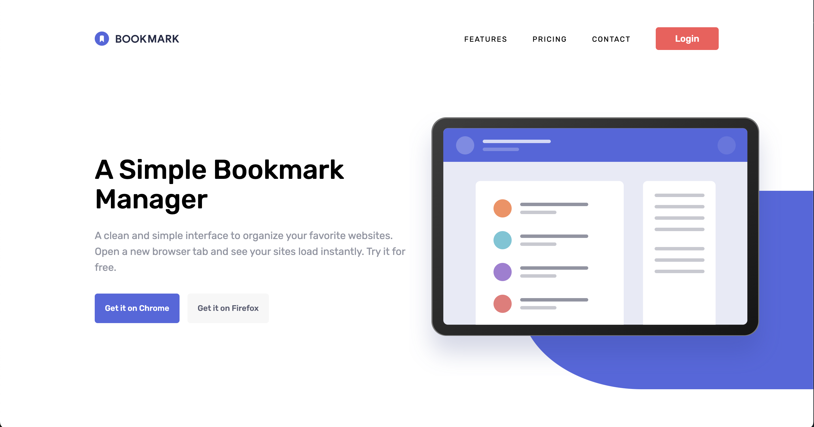

# Frontend Mentor - Bookmark landing page solution

This is a solution to the [Bookmark landing page challenge on Frontend Mentor](https://www.frontendmentor.io/challenges/bookmark-landing-page-5d0b588a9edda32581d29158). Frontend Mentor challenges help you improve your coding skills by building realistic projects.

## Table of contents

- [Overview](#overview)
  - [The challenge](#the-challenge)
  - [Screenshot](#screenshot)
  - [Links](#links)
  - [Built with](#built-with)
  - [Continued development](#continued-development)
  - [Useful resources](#useful-resources)
- [Author](#author)
- [Acknowledgments](#acknowledgments)

## Overview

Accessible, responsive and animated React application. Has tabs and accordion custom components. Form email input displays error state.

### The challenge

Users should be able to:

- View the optimal layout for the site depending on their device's screen size
- See hover states for all interactive elements on the page
- Receive an error message when the newsletter form is submitted if:
  - The input field is empty
  - The email address is not formatted correctly

### Screenshot

### Links

- Solution URL: [https://github.com/NikitaVologdin/Bookmark-landing-page](https://github.com/NikitaVologdin/Bookmark-landing-page)
- Live Site URL: [https://bookmark-landing-page-ashen-five.vercel.app/](https://bookmark-landing-page-ashen-five.vercel.app/)

### Built with

- Semantic HTML5 markup
- CSS custom properties
- Flexbox
- CSS Grid
- Mobile-first workflow
- Sass
- [React](https://reactjs.org/) - JS library
- [Motion](https://motion.dev/) - Animation library

### Continued development

- Minifying build css bundle, adding prefixes for css.
- Accordion item bottom padding issue with expanding animation.

### Useful resources

- [Full Width Containers in Limited Width Parents](https://css-tricks.com/full-width-containers-limited-width-parents/) - This helped me for XYZ reason. I really liked this pattern and will use it going forward.
- [Tabs Pattern](https://www.w3.org/WAI/ARIA/apg/patterns/tabs/) - Guide how to build a accessible tabs component
- [Scalable svg](https://css-tricks.com/scale-svg/) - Explains Scaling SVG issues.

## Author

- Website - [Nikita Vologdin](https://vologdin.eu/portfolio)
- Frontend Mentor - [@NikitaVologdin](https://www.frontendmentor.io/profile/NikitaVologdin)
